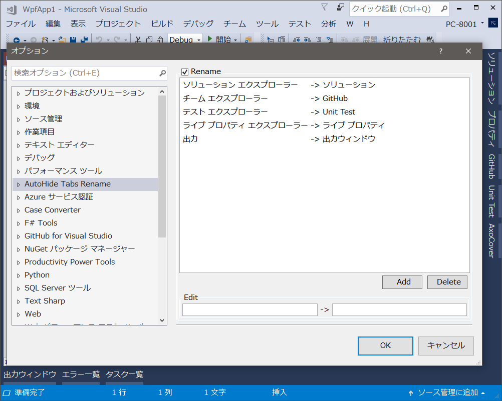

# AutoHideTabRename
  

## 概要
Visual Studio 拡張機能  
ツールウィンドウのタブ名を変更します。

## 特徴
Visual Studio（以下VS）のツールウィンドウ（[ソリューション エクスプローラー]等）を自動的に隠す設定（📌ボタン）にしたり、ウィンドウを複数重ねたりするとタブになります。が、
* 無駄に長い（特にしつこいエクスプローラー推し）
* 出しておきたいタブが多くなり置き場に困ってきた

の点が気になったので、短く（任意の名前に）変更できるようにしました。  

## ダウンロード
一応VSIXを用意しましたが、ソースを確認したうえで各自ビルドを推奨。  
[最新バイナリ](/../../releases/download/v1.0.0/AutoHideTabRename.vsix)（Windows10でのみ動作確認）

## 使い方
1. AutoHideTabRename.vsixをダブルクリックし、VSにインストールします。
2. VSメニューの[ツール]－[オプション...]－[AutoHide Tabs Rename]を開きます。
3. いくつか設定が入っていますが、お好みに設定してください。  
 左が変更前のタブ名、右が変更後のタブ名です。（変更前のタブ名は完全一致です。先頭一致や部分一致ではありませんので注意してください。）

#### アンインストール
1. AutoHideTabRenameのオプションで[Rename]のチェックを外し、元の状態に戻します。
2. VSメニューの[ツール]－[拡張機能と更新プログラム...]からAutoHideTabRenameを選択し、\[アンインストール]ボタンを押します。  
設定も一緒に消えますので必要な場合は各自でバックアップしてください。

## ライセンス
[MIT](LICENSE)

## 注意事項
* 一切責任持ちません。
* ウィンドウタイトルを変更しないのは仕様です。
* アンインストール後にタブ名が元に戻らない場合は、お手数ですが下記のリセットをしてください。

#### リセット方法
ほとんどのツールウィンドウは開いた時にタブ名を再設定をしますが、一部戻らないものがありました。  
その際はキャッシュの削除で戻ります。（ウィンドウレイアウトもデフォルトに戻ってしまいますが、ご了承ください。）  
`C:\Users\[ユーザー名]\AppData\Roaming\Microsoft\VisualStudio\[VSバージョン]\WindowLayouts\`  
の中のファイルをすべて削除してください。

#### インストールフォルダ
フォルダ名は予測不能なので作成日時等であたりをつけて、AutoHideTabRename.dllがあるフォルダを探してください。  
`C:\Users\[ユーザー名]\AppData\Local\Microsoft\VisualStudio\[VSバージョン]\Extensions\[ランダム文字列]`

#### 設定ファイル
`[インストールフォルダ]\config.xml`

